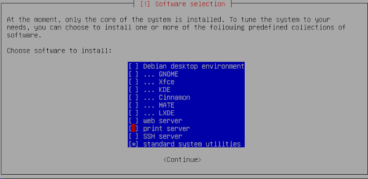

# Отчет №1: Установка ОС

- Выбираем обычную установку
- Выбираем английский язык

- Выбираем регион: Европа |> Россия

- Выбираем часовой пояс (Москва)

- Выбираем имя хоста для машины (желательно, более-менее уникальное, чтобы избежать совпадений внутри сети)

- Выбор домена для машины
.png)

- Задаем пароль для пользователя root
- Создаем первого пользователя (чтобы не сидеть из-под root'а)

- Разбиваем диск. Мне пришлось сначала полностью очистить его, после чего я смог разметить его так, как посчитаю нужным:
- * ~1Гб под раздел `/boot`. Основной диск, файловая система `ext-2` (нежурналируемый)
- * ~2Гб под `swap`. Логический диск, тип `swap`
- * Остальное пространство (~5.5Гб) для корневого раздела. Логический диск, тип `ext-4` (журналируемый)

- Выбираем оболочку и ПО, которое мы хотим установить. Я выбрал:
- * Оболочку XFCE
- * SSH сервер

- Так как устанавливаем через Virtual Box, это будет первая система и надо поставить загрузчик
